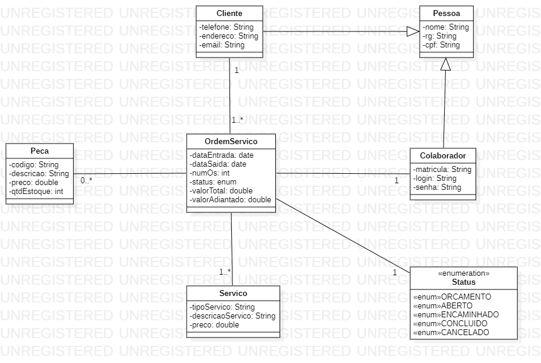
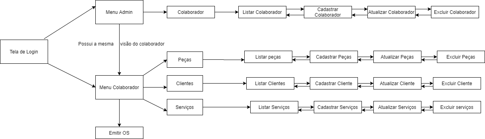

<h1> Documentação </h1>

<h3> Nome do projeto </h3>

- Help computer

 <h3> Descrição geral do projeto </h3> 

Gerenciar loja de manutenção de computadores bem como o acesso exclusivo por funcionários, emissão de ordens de serviços para clientes. Na ordem de serviço constará o nome do funcionário que o atendeu e quem fez a manutenção, descrição do defeito, data e hora, dados do cliente, serviços e produtos adquiridos.

* <b> UML </b>

* <b> Fluxo de telas </b>

